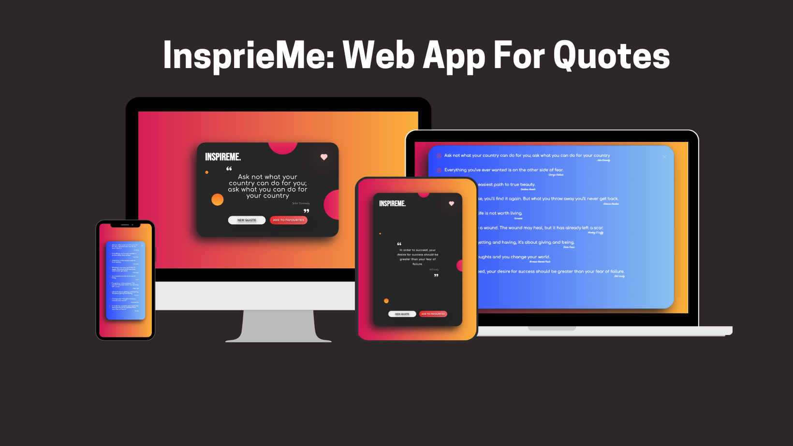

# Quotes Web App

InspireMe is a React app that fetches random quotes from an API and lets users save their favourites with a single click, providing an easy way to discover and curate inspiring quotes.

## Features

- Display a random quote from an API.
- Option to add quotes to a favourites list.
- Toggle between viewing and hiding favourites.
- Interactive UI with styled components.
- Ability to delete a quote from the favourites list.

## Live Site
The QuotesApp is hosted on Netlify. You can view the live app at the following URL:

https://quotes-app-aishwinj.netlify.app/

## How It Works
### Fetching Quotes
- The app fetches a random quote from an API when you click the New Quote button.
- The API used is from https://github.com/well300/quotes-api.
  
### Favorites
- Users can add a quote to the Favorites list by clicking the Add to Favourites button.
- The app stores the favourites locally and displays them when toggled by clicking the heart icon.
- Users can also delete quotes from their favourites.
  
### Code Structure
QuotesApp Component: The main component that handles quote fetching, favorites management, and UI rendering.
useState Hooks: Manage the state for quotes, favourites, and the visibility of the favourites list.
Screenshot
